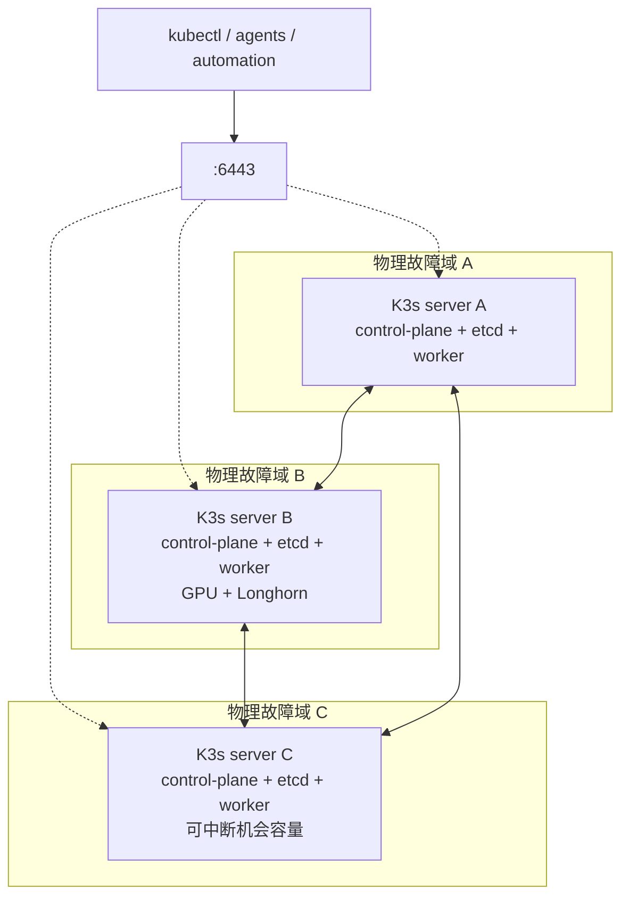

# 可中断第三主机的 K3s 三控制面规划

## 状态

当前处于构想阶段，本文定义目标、背景、设计、执行计划和验收条件，不授权部署或修改集群状态

## 领域术语

| 术语 | 定义 |
|---|---|
| 稳定多数派 | 长期在线的 A、B 两个 K3s server |
| 可中断成员 | 可随时关闭的 C，同时是 K3s server、etcd 成员和普通 worker |
| 稳定容量 | A+B 能长期提供的 CPU、内存、设备和存储能力 |
| 机会容量 | C 在线时提供的额外 CPU 和内存，不作为必要业务成立条件 |
| 冗余降级 | C 离线，A+B 保持 2/3 etcd quorum，但集群无法再失去一个 server |
| 可迁移业务 | 允许在 C 关闭后短暂中断，并能在 A/B 自动重建或安全重新挂载的工作负载 |

## 背景

当前集群由三个 Kubernetes Node 组成：

- A 是单个 K3s server，承载 control-plane、单成员 embedded etcd 和普通工作负载
- B 是 K3s agent，承载普通工作负载和 GPU 工作负载
- C 已作为 K3s agent 接入并稳定在线，承载普通工作负载，不提供 GPU 与 Longhorn 数据盘

本次只读检查确认 A 的 live K3s 配置包含 `cluster-init: true`，当前没有可列出的 etcd snapshot。实施时仍需重新查询 live 状态，不能只依据仓库配置判断

C 是 M1 Mac Mini 上的 Lima VM，现已与 A、B 处于同一局域网，不再通过异地路由器和 ZeroTier 承载节点间通信。现行 VM 配置见 `lima/yuuko.yaml`

C 的宿主机需要保留给其他用途。C 在线时应尽量分担集群压力，需要使用宿主资源时允许直接执行正常的 `limactl stop`，离线时长不设上限

本规划要解决的是把三个节点改造成三个 etcd 成员，使 C 的随时离线不危及集群。把 C 接进来这一步已经完成

## 目标

- A、B、C 分别位于三个物理故障域
- 三个节点全部运行 K3s server、control-plane 和 embedded etcd
- 三个 server 同时作为 worker，C 在线时参与普通调度
- C 正常关闭或意外离线后，A+B 保持 etcd quorum、API 可用和必要业务可用
- A+B 独立容纳全部必要业务 requests 和故障恢复突发
- C 在线时优先承载可迁移业务，释放 A/B 的日常 CPU 和内存压力
- API 使用能在 A、B、C 之间漂移的固定入口
- C 使用原 VM 磁盘重新上线后恢复原 etcd member 身份并完成数据追赶

## 接受的退化

C 直接关闭时允许：

- etcd 和 kube-vip 短暂重新选主
- 已建立的 API TCP 连接重置后重连
- C 上的可迁移业务短暂中断
- Pod 在 A/B 重新调度
- 可安全迁移的卷经历 detach 和 attach

进入稳定状态后必须满足：

- 固定 API endpoint 持续可访问
- etcd 保持 2/3 quorum
- scheduler、controller-manager 和 Flux 继续收敛资源
- C 上的必要业务能够在 A/B 重新调度
- A/B 不依赖 C 的 CPU、内存、GPU 或存储才能承载必要业务

## 非目标

- 同时容忍 C 与 A/B 任一 server 离线
- 让 C 提供 Longhorn 数据故障域
- 保证 C 上所有业务在关机时零中断
- 将 C 的机会容量计入稳定容量
- 为当前不存在的自动 K3s 升级或固定维护流程设计门禁控制器
- 为当前没有使用习惯的 Dashboard 或 C 离线通知设计新告警
- 在本阶段执行节点重装、etcd 成员变更或集群部署

## 目标架构



### 节点职责

| 节点 | 在线承诺 | 普通调度 | 状态与设备 |
|---|---|---|---|
| A | 长期在线 | 允许 | 现有通用业务和 Longhorn |
| B | 长期在线 | 允许 | 现有通用业务、GPU 和 Longhorn |
| C | 可随时关闭 | 允许 | 不提供 Longhorn 数据盘，不提供 GPU |

K3s server 默认具备 worker 能力。三个 server 都保留普通调度能力，不为 C 添加 `NoSchedule` taint

### Quorum 状态

三个 embedded etcd 成员的 quorum 为 2

| 在线成员 | etcd | API 与业务 | 状态 |
|---|---|---|---|
| A+B+C | 3/3 | 可用 | 正常且可容忍一个成员故障 |
| A+B | 2/3 | 可用 | 冗余降级 |
| A+C | 2/3 | 可用 | B 故障恢复状态 |
| B+C | 2/3 | 可用 | A 故障恢复状态 |
| 任一单成员 | 1/3 | 控制面不可写 | quorum 丢失 |

C 离线可以成为长期状态。此时 A+B 维持集群，但任何会停止 A 或 B 的操作都会丢失 quorum。这是三成员 etcd 的固有边界，当前不新增自动门禁

## 固定 API 入口

### 现状与历史

当前 `k3s_registration_address` 指向 A 的节点地址，仍是 API 入口单点

仓库历史中曾测试并删除 `kube-vip-cloud-provider`。该组件负责给 `LoadBalancer` Service 分配地址，属于现有 Cilium LB IPAM/BGP 已覆盖的职责，与本规划的 control-plane VIP 不同

当前 Cilium 配置：

- `kubeProxyReplacement: true` 替代 kube-proxy 的 Service 转发
- `k8sServiceHost: 127.0.0.1` 与 K3s supervisor 端口供节点内 Cilium 连接本地 API
- LB IPAM 和 BGP 负责 Service `LoadBalancerIP` 与 PodCIDR
- 以上能力不提供集群外固定的 K3s API endpoint

### 方案比较

| 方案 | 优点 | 当前代价 |
|---|---|---|
| kube-vip control-plane ARP | K3s 官方支持，与 CNI 和 Service LB 职责分离 | 增加一个专用 DaemonSet 和最小 RBAC |
| Cilium BGP API Service | 复用现有 BGP，可实现多路径 | Talos 上游可直接选择 kube-apiserver Pod，当前 K3s 需要额外维护 selectorless Service/EndpointSlice，入口依赖 Cilium 与路由器 |
| 路由器 L4 LB | 与集群内组件解耦 | 当前路由器没有已声明的 TCP 健康检查 LB，需要新增宿主服务和维护路径 |
| 单 server 地址 | 无新增组件 | A 离线后外部 API 入口失效 |

### 决策

使用 kube-vip control-plane-only ARP DaemonSet：

- A、B、C 全部参与 VIP leader election
- 任意两个 server 在线时均能同时提供 etcd quorum 与 API 入口
- kube-vip 不管理 Service `LoadBalancer`
- Cilium 继续独占 Service LB IPAM、Service BGP 和 PodCIDR BGP
- VIP 加入三个 server 的 `tls-san`
- `k3s_registration_address`、外部 kubeconfig 和后续 server join endpoint 使用 VIP
- kube-vip 由 Flux 管理，归属 infra 层

三个 server 同处一个二层网络，ARP 模式具备设计前提。实施前验证 Lima bridge、PVE bridge、交换网络和路由器能正确处理 gratuitous ARP

### 启动边界

kube-vip 代理已经运行的 API，不负责启动 API。首次 bootstrap 和灾难恢复保留节点直连路径：

```text
A 使用节点地址启动 K3s API
→ Flux 和 Cilium Ready
→ Flux 部署 kube-vip
→ VIP Ready
→ B、C 通过 VIP 加入
→ 外部 kubeconfig 切换到 VIP
```

全部 server 重启时：

```text
各 server 从本地配置启动
→ embedded etcd 达到 quorum
→ 本地 API 和 Cilium 恢复
→ kube-vip 恢复 leader election
→ VIP 恢复
```

VIP 在 Cilium 和 kube-vip 恢复前可能暂时不可用。A、B、C 的节点直连地址必须保留在恢复文档中

## C 的机会型调度

### 调度原则

C 不加 taint，使用节点标签表达可中断属性：

```text
availability.home.arpa/class=interruptible
topology.kubernetes.io/zone=<PHYSICAL_FAILURE_DOMAIN>
```

工作负载按恢复能力分为三类：

| 类型 | C 上的策略 | 示例条件 |
|---|---|---|
| 可迁移业务 | 软偏好 C | 无设备绑定，能够在 A/B 重建，允许短暂中断 |
| 必要单实例与关键状态 | 硬排除 C | 唯一数据库实例、唯一入口、恢复依赖人工的状态 |
| 物理能力绑定业务 | 按能力标签调度 | GPU、Multus、hostPath、特定架构 |

可迁移业务使用 `preferredDuringSchedulingIgnoredDuringExecution` 偏好 C。C 不在线时，scheduler 自动回退到 A/B

必要单实例和关键状态使用 required node affinity 排除 `class=interruptible`。该约束表达业务恢复边界，不依赖 hostname

### 最大化分担

第一阶段优先迁移：

- 无状态 Deployment
- 已有多个副本且单副本离线不影响服务的组件
- 无 GPU、Multus 和 hostPath 依赖的后台控制器
- 可重试的计算任务
- 经验证能安全重新挂载卷的非关键业务

第一阶段保留在 A/B：

- Longhorn 数据 replica 与 InstanceManager
- 关键数据库和唯一状态实例
- GPU 工作负载
- 依赖 Multus、局域网固定地址或 node-local hostPath 的工作负载
- 尚未完成断电恢复验证的 PVC 工作负载

现有 descheduler 已启用：

- `LowNodeUtilization`
- `RemovePodsViolatingNodeAffinity`
- `RemovePodsViolatingTopologySpreadConstraint`

C 上线后，scheduler 只影响新 Pod；descheduler 可以驱逐 A/B 上违反软偏好的合格 Pod，使其重新调度到 C。每个纳入软偏好的工作负载必须先验证驱逐安全性

动态热点不写入本文。执行时通过以下命令选择候选：

```bash
kubectl top pods -A --sort-by=cpu
kubectl top pods -A --sort-by=memory
kubectl get deployments,statefulsets -A -o wide
```

### 稳定容量验收

关闭 C 后验证：

- A+B 能容纳全部必要 Pod requests
- 必要 Pod 不因 CPU、内存、GPU、volume affinity 或 topology constraint 持续 Pending
- Longhorn 的升级、恢复和 replica 操作仍有突发余量
- C 在线时的资源下降只计为优化效果，不作为稳定容量证明

## C 的关闭与恢复

### 正常关闭

日常关闭使用正常的 `limactl stop`，不要求人工 drain

当前 kubelet 的 graceful shutdown 时长为默认值 0，实际不会为 Pod 预留关机窗口。实施时只为 C 配置非零的：

- `shutdownGracePeriod`
- `shutdownGracePeriodCriticalPods`

具体时长通过一次受控关闭演练确定，确保普通 Pod 先终止，节点级关键 Pod 后终止，并且宿主机能在可接受时间内完成关机

### 非正常断电

宿主机掉电或强制终止 VM 属于故障路径：

- 无状态 Pod 等待 Node 失联判定后在 A/B 重建
- StatefulSet 和已挂载 PVC 可能等待原 Pod 删除与 volume detach
- 确认 C 已真正关机后，可按 Kubernetes Non-Graceful Node Shutdown 流程添加 `node.kubernetes.io/out-of-service` taint
- C 恢复前必须移除该 taint

第一阶段不新增自动判定或自动 taint 控制器，避免误判仍在线的节点并造成重复挂载

### etcd member 恢复

以下情况可以按原 member 恢复：

- 原 VM 磁盘存在
- K3s server 数据目录未清理
- etcd membership 未移除
- 节点身份未替换

以下情况必须执行成员替换：

- VM 被删除或重建
- server 数据目录丢失
- 旧 member 已从 etcd membership 移除
- 节点身份发生变化

旧 member 一旦被移除，不能带原 etcd 数据目录直接重新加入

## 迁移前备份

当前 live 集群使用单成员 embedded etcd，且没有可列出的 snapshot。进入成员变更前：

1. 创建一次按需 etcd snapshot
2. 保存对应的 server token
3. 将 snapshot 与 token 保存到 A 之外
4. 记录 K3s 版本和 snapshot 校验信息
5. 在隔离环境验证 restore 后 API 数据可读

现有位于 A 同一物理故障域的对象存储不能作为唯一迁移备份

本次只建立覆盖成员变更的一次性可恢复备份，不扩展为定时 snapshot、长期保留和告警项目

## 执行计划

### 阶段一：确认前提

1. 只读确认 live K3s 版本、server 参数、etcd member、endpoint health 和 alarms
2. 确认 A/B/C 的节点地址、网卡和二层互通
3. 测量 C 在宿主机运行其他任务时的 CPU、内存和根盘延迟
4. 选择未占用的 `<CONTROL_PLANE_VIP>`
5. 验证 VIP 地址不与 DHCP、Cilium LB pool 和其他静态地址冲突
6. 确定 graceful shutdown 时长

完成条件：C 的资源和磁盘能稳定运行 K3s server，ARP VIP 网络前提成立

### 阶段二：建立一次性可恢复备份

1. 创建按需 etcd snapshot
2. 将 snapshot 与 server token 保存到 A 之外
3. 校验备份文件
4. 在隔离环境执行 restore
5. 验证恢复后的 API 数据

完成条件：备份能够独立恢复单成员控制面

### 阶段三：建立 API VIP

1. 在 infra 层添加 control-plane-only kube-vip
2. 固定镜像版本与 digest
3. 使用官方权限清单收敛最小 RBAC
4. 让现有 server A 首先运行 kube-vip
5. 将 VIP 加入 A 的 TLS SAN
6. 验证 A 宣告 VIP 且 API 可达
7. 将 registration address 和外部 kubeconfig 切到 VIP
8. 保留 A 的直连恢复方式

完成条件：VIP 能访问现有单 server API，现有 Cilium Service LB 行为不变

### 阶段四：形成三成员 etcd

1. 统一 A、B、C 的 K3s server 参数
2. 将 B 从 agent 迁移为 server
3. 确认 B 成为第二个 healthy etcd member
4. 在同一维护窗口将 C 从 agent 迁移为 server，加入为第三个成员
5. 确认 A/B/C 均为 healthy voting member
6. 验证 kube-vip 能在 A/B/C 之间漂移
7. 更新 Ansible inventory、节点启动和停止逻辑

B、C 当前都是 agent 且已在线，改造是就地迁移为 server，无需新节点加入。迁移只改变 K3s 角色，B 的 GPU 标签与 C 的可中断属性必须保留，不应因迁移而影响调度

两成员 etcd 不是稳定终点。B 迁移完成后必须立即完成 C 迁移，期间不执行 server 故障演练

完成条件：三个物理故障域各有一个 healthy server，任意两个 server 能维持 quorum 与 API VIP

### 阶段五：建立机会型调度

1. 为 C 添加可中断属性和物理故障域标签
2. 保留 B 从 agent 迁移前已有的 GPU 标签
3. 禁止 Longhorn 在 C 创建数据盘
4. 识别第一批可迁移业务
5. 为可迁移业务添加 C 的软偏好
6. 为关键状态和物理能力绑定业务添加硬约束
7. 验证 descheduler 只驱逐允许迁移的 Pod
8. 确认 C 在线后实际承担 CPU 和内存负载

完成条件：C 在线时能分担可迁移负载，关闭 C 后必要业务仍能在 A/B 收敛

### 阶段六：配置优雅关闭

1. 为 C 配置 kubelet graceful shutdown 时长
2. 使用正常 `limactl stop` 执行受控关闭
3. 观察 Pod 终止顺序、API VIP 迁移和 etcd leader election
4. 调整 grace period
5. 重新启动原 C VM并验证 etcd catch-up

完成条件：正常关闭无需人工 drain，关键业务只发生已接受的短暂退化

### 阶段七：故障演练

1. A/B/C 全部在线时记录 etcd、VIP、Pod 和容量基线
2. C 是 kube-vip leader 时正常关闭 C
3. 验证 A+B 保持 2/3 quorum 和 VIP 可达
4. 验证 C 上的可迁移业务在 A/B 恢复
5. 保持 C 离线并验证稳定容量
6. 重启原 C VM，验证恢复 3/3 quorum
7. C 在线时分别演练 A、B 单节点故障
8. 演练 C 非正常断电和人工 `out-of-service` 恢复流程

完成条件：A、B、C 三种单主机故障均保留 quorum 与 API 入口，C 的正常关闭满足本文目标

### 阶段八：同步已部署架构

1. 更新 `docs/ARCHITECTURE.md`
2. 更新集群启动、停止和恢复说明
3. 保留异地 ZeroTier 文档作为历史方案
4. 记录实测 API 恢复时间和优雅关闭参数

完成条件：架构文档只描述实际部署状态，恢复文档保留 VIP 与节点直连两条路径

## 回滚原则

- 成员变更失败时先恢复 etcd quorum
- 两成员 etcd 不能成为回滚终点
- 无法形成三成员时回到原单 server
- 移除 member 前确认剩余 membership 与 snapshot
- VIP 回退时同步恢复 registration address、TLS SAN 和 kubeconfig
- C 不适合作为长期 member 时清理其 membership，不保留永久失联成员伪装三控制面

## 验收清单

- [ ] 三个 server 分布在三个物理主机
- [ ] 三个 server 参数一致并保持 3/3 etcd healthy
- [ ] kube-vip 由 Flux 管理且不接管 Service LB
- [ ] API VIP 可由 A、B、C 任一 server 持有
- [ ] 任一 server 离线后剩余两个保持 quorum 与 VIP
- [ ] C 不提供 Longhorn 数据盘
- [ ] A+B 独立容纳全部必要业务
- [ ] C 在线时实际分担可迁移业务负载
- [ ] 正常 `limactl stop` 无需人工 drain
- [ ] C 离线后允许的局部中断能自动恢复
- [ ] 原 C VM 重启后恢复原 member 并完成 catch-up
- [ ] 非正常断电恢复流程完成演练
- [ ] etcd snapshot 与 server token 已在 A 外完成恢复验证
- [ ] 实际部署完成后更新 `docs/ARCHITECTURE.md`

## 实施时确定的参数

- `<CONTROL_PLANE_VIP>` 的地址
- kube-vip 镜像版本、digest 和最小 RBAC
- C 的固定 CPU、内存和磁盘 I/O 保留
- `shutdownGracePeriod` 与 `shutdownGracePeriodCriticalPods`
- 第一批软偏好 C 的可迁移业务
- 需要硬排除 C 的关键状态业务

这些参数通过实施阶段的 live 查询、网络探测、资源观测和故障演练确定，不需要在构想阶段猜测

## 依据

- K3s embedded etcd 三成员 quorum 与固定 registration address
  <https://docs.k3s.io/datastore/ha-embedded>
- K3s control-plane load balancer 与 kube-vip
  <https://docs.k3s.io/datastore/cluster-loadbalancer>
- kube-vip 在 K3s 的 DaemonSet 部署方式
  <https://kube-vip.io/docs/usage/k3s/>
- Cilium kube-proxy replacement
  <https://docs.cilium.io/en/stable/network/kubernetes/kubeproxy-free/>
- Cilium BGP Service 宣告
  <https://docs.cilium.io/en/stable/network/bgp-control-plane/bgp-control-plane-configuration/>
- Kubernetes Graceful Node Shutdown 与 Non-Graceful Node Shutdown
  <https://kubernetes.io/docs/concepts/cluster-administration/node-shutdown/>
- 当前 controller 参数
  `ansible/inventory/group_vars/controllers/main.yaml`
- 当前 registration address
  `ansible/inventory/group_vars/k8s/all.yml`
- 当前 Cilium 配置
  `k8s/infra/common/kube-system/cilium/app/values.yaml`
- 当前 descheduler 策略
  `k8s/infra/common/kube-system/descheduler/app/helmrelease.yaml`
- 当前 C 的 Lima 配置
  `lima/yuuko.yaml`
