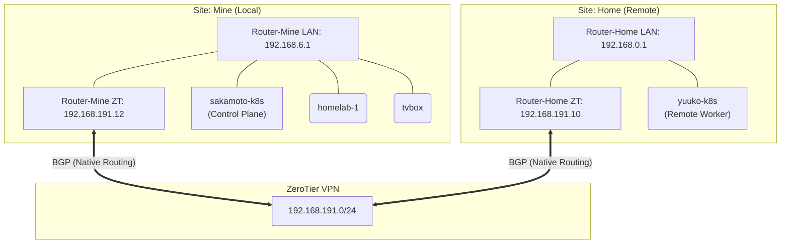

<h3 align="center">
<br/>

 Homelab for <a href="https://github.com/shelken">Shelken</a>

</h3>

<p align="center">

</p>

<div align="center">

[](https://github.com/kashalls/kromgo)&nbsp;&nbsp;
[](https://github.com/kashalls/kromgo)&nbsp;&nbsp;
[](https://github.com/kashalls/kromgo)&nbsp;&nbsp;
[](https://github.com/kashalls/kromgo)&nbsp;&nbsp;
[](https://github.com/kashalls/kromgo)&nbsp;&nbsp;
[](https://github.com/kashalls/kromgo)&nbsp;&nbsp;
[](https://github.com/kashalls/kromgo)&nbsp;&nbsp;
[](https://prometheus.ooooo.space/alerts)

</div>

&nbsp;

# home-ops

homelab

## 网络拓扑



## 集群节点

| 节点名       | 角色                | 宿主机                              | CPU    | 内存 | 架构  | IP            | 系统盘    | Longhorn 存储 |
| ------------ | ------------------- | ----------------------------------- | ------ | ---- | ----- | ------------- | --------- | ------------- |
| sakamoto-k8s | control-plane, etcd | Mac Mini M4 (4P+6E 核, Lima VM, vz) | 8 vCPU | 14GB | arm64 | 192.168.6.80  | 80GB      | 1TB SSD       |
| homelab-1    | worker              | 笔记本 PVE (Intel i5-7300HQ 4核) VM | 4 核   | 14GB | amd64 | 192.168.6.110 | 321GB     | 共用系统盘    |
| tvbox        | worker              | S905x3 电视盒子 (Armbian)           | 4 核   | 4GB  | arm64 | 192.168.6.141 | 28GB eMMC | 无            |
| yuuko-k8s    | worker              | Mac Mini M1 (4P+4E 核, Lima VM, vz) | 6 vCPU | 14GB | arm64 | 192.168.0.81  | 40GB      | 无            |

## 设备网络

> lb ip range: 192.168.69.0/24

| 服务                   | ip            | 描述                      | domain    | multus |
| ---------------------- | ------------- | ------------------------- | --------- | ------ |
| k8s-gateway            | 192.168.69.41 | 开放给外部 dns            |           |        |
| envoy external gateway | 192.168.69.45 |                           |           |        |
| envoy internal gateway | 192.168.69.46 |                           |           |        |
| postgres-lb            | 192.168.69.52 | 开放postgres              | postgres. |        |
| plex                   | 192.168.69.54 |                           |           |        |
| immich-db              | 192.168.69.56 |                           |           |        |
| seafile-db             | 192.168.69.57 |                           |           |        |
| mosquitto              | 192.168.69.59 |                           |           |        |
| vistoria-logs          | 192.168.69.66 | 给其他设备（vps）发送日志 |           |        |
| crowdsec               | 192.168.69.67 | 其他设备agent/bounce连接  |           |        |
| netbird                | 192.168.70.44  | 关闭 保留                 |           | multus-ipv6 |
| caddy-external         | 192.168.70.47  |                           |           | multus-ipv6 |
| home assistant         | 192.168.50.51 | mDNS                      |           | multus-iot  |
| go2rtc                 | 192.168.6.53 | mDNS                      |           | multus-homekit  |
| qbittorrent            | 192.168.70.58  | IPv6 直连                 |           | multus-ipv6 |
| tailscale-sub-router   | 192.168.70.65  | IPv6 直连                 |           | multus-ipv6 |
| tailscale-node-vps     | 192.168.70.66  | IPv6 直连                 |           | multus-ipv6 |

## multus 网络定义

[参考-网络类型](k8s/infra/common/network/multus/networks/README.md)

## 服务网络

| 服务 | 状态                                                                            |
| ---- | ------------------------------------------------------------------------------- |
| echo |  |

## 核心组件

### Core Components

- [cert-manager](https://github.com/cert-manager/cert-manager): Creates SSL certificates for services in my cluster.
- [cilium](https://github.com/cilium/cilium): eBPF-based networking for my workloads.
- [external-dns](https://github.com/kubernetes-sigs/external-dns): Automatically syncs ingress DNS records to a DNS provider.
- [k8s-gateway](https://github.com/k8s-gateway/k8s_gateway): https://github.com/k8s-gateway/k8s_gateway
  <!-- - [external-secrets](https://github.com/external-secrets/external-secrets): Managed Kubernetes secrets using [1Password Connect](https://github.com/1Password/connect). -->
  <!-- - [rook](https://github.com/rook/rook): Distributed block storage for peristent storage. -->
- [sops](https://github.com/getsops/sops): Managed secrets for Kubernetes and Terraform which are commited to Git.
  <!-- - [spegel](https://github.com/spegel-org/spegel): Stateless cluster local OCI registry mirror. -->
  <!-- - [volsync](https://github.com/backube/volsync): Backup and recovery of persistent volume claims. -->

## 初始化所需Secret

> 以下secret存储在 Azure KeyVault 或任何 external secret 提供商
>
> [resources](/bootstrap/resources.yaml)

| secret key      | 用途                                                      | 备注 |
| --------------- | --------------------------------------------------------- | ---- |
| azure-creds     | external-secret 获取secret必须                            |      |
| flux-instance   | flux-instance 拉取private repo必须                        |      |
| sops            | 部分使用sops加密的配置                                    |      |
| ooooo-space-tls | 域名证书（加快集群部署速,度避免cert-manager多次获取证书） |      |

## flux

### 疑难问题

- `dry-run failed: no matches for kind "OCIRepository in version "source.toolkit.fluxcd.io/v1`

检查cli安装的版本，版本太低与文件定义的api版本和实际版本对不上。

直接升级cli版本，然后Bootstrap 让flux自动升级。

ocirepo 在 2.6上才是v1，在2.5上配置是v1beta2

- 卸载longhorn（删除helmrelease）前

```shell
kubectl -n longhorn-system patch -p '{"value": "true"}' --type=merge lhs deleting-confirmation-flag
```

- 每次重建集群之后，cilium总是不给gateway ip

`task restart-cilium` 重启后正常了

- lima 无法挂载磁盘

```json
{
  "level": "fatal",
  "msg": "failed to run attach disk \"longhorn\", in use by instance \"sakamoto-k8s\"",
  "time": "2025-07-08T14:24:21+08:00"
}
```

`limactl disk unlock longhorn`

- 迁移secret后， external-secrets 无法push

因为external-secret azure会自动给pushsecret打上tag，表示由external-secret管理，迁移时没有加上这个tag

导致出现问题, 删掉secret让external-secret重新同步。

- longhorn 的daemonset在重启k3s或者机器时存在Misscheduled的情况

删掉对应 pod 解决

非常奇怪。。。。。。

- smb 中文乱码问题

宿主机缺失相关动态库

```shell
sudo apt-get install -y cifs-utils linux-modules-extra-$(uname -r)
```

- 遇到helmrelease/kustomization卡住的情况

```shell
flux suspend helmrelease cilium -n kube-system
flux resume helmrelease cilium -n kube-system
```

- 遇到multus设备无法获取，且同时存在两个相同pod

检查更新策略，不要设置滚动更新

如果有部署自带，通过以下操作去除滚动更新

```
postRenderers:
  - kustomize:
      patches:
        - target:
            kind: Deployment
            name: xxx
          patch: |-
            - op: remove
              path: /spec/strategy/rollingUpdate
```

- 哪些情形不适合使用滚动更新？

- 设置了multus的容器，会被上一个占用网卡
- 设置了 readwriteonce pvc的

- L2宣告问题，导致某个lbip无法连接

我们可能会有这种情况，一个服务，例如a，此时a服务需要一个lbip

当分配时，例如节点a获取到了这个服务的领导（因为各种情况，例如仅只有a节点存活），

此时lease在a，a只有一个副本，且我们配置了a服务仅能运行在节点b。当我们把externalTrafficPolicy设为local时

此时我们对a发起请求，或者连接a的端口，发现被拒绝，因为此时b节点拿到流量发现没有a服务且`externalTrafficPolicy=Local`，直接丢弃流量

我们可以删除a当前获取的lease `kubectl delete lease x -n kube-system`

但是，不想每次手动，需要考虑为服务创建2个以上

- multus 网卡的使用情况

只有几种情况需要用multus：

**multus-ipv6** - 需要 IPv6/UDP 直连的服务：
  - tailscale (subnet-router, node-vps)
  - qbittorrent
  - caddy-external
  - netbird-router (暂未使用)

**multus-iot** ：
  - home-assistant

**multus-homekit** ：
  - go2rtc

**multus-main (eth1, 192.168.6.0/24)** - 保留备用

除此之外需要单独 IP 的都应该使用 L2 宣告，并严格限定端口

- 容器频繁重启且有规律（smb）

如果都是使用smb，那么应该是`smb-scaler`的问题

keda 通过检查 prometheus 的指标获取smb服务情况。

blackbox 采集smb端口连通性（使用了域名）

dns 如果无法正常解析lan域名的话，blackbox会失败，进而出问题。

因此检查blackbox容器是否存在检测问题或者当前smb连接情况
