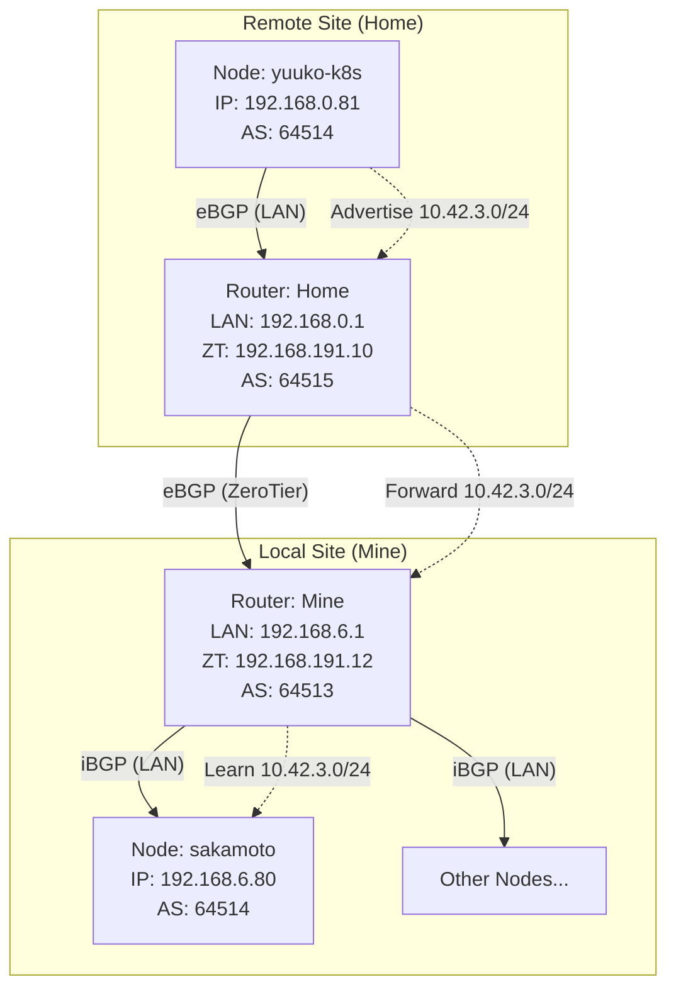

# 跨地域节点互联架构 (BGP 全互联方案)

本文档记录了将异地节点（`yuuko-k8s`）接入本地 K3s 集群并实现 **Native Routing (原生路由)** 的最终架构方案。

此方案通过在两端路由器上运行 BGP 协议，打通了跨地域的 Pod 网络，实现了无需手动维护静态路由、无需 Overlay 封装的高性能三层互通。

## 1. 网络拓扑

### 架构概览

*   **本地网络 (Mine)**: `192.168.6.0/24`
*   **远程网络 (Home)**: `192.168.0.0/24`
*   **互联链路 (VPN)**: ZeroTier `192.168.191.0/24`
*   **Pod 网络**: `10.42.0.0/16` (Native Routing)

### BGP 拓扑图



## 2. 关键配置

### 2.1 路由器配置 (BIRD)

两端路由器均需安装 `bird2`。

#### Remote Router (Router-Home)
*   **角色**: 中继网关。负责连接本地的 Yuuko 节点，并将路由通过 VPN 传给 Router-Mine。
*   **配置要点**:
    *   ASN: `64515` (与 Mine 组成 eBGP，配置更简单)。
    *   监听接口: `br-lan` (LAN), `zt*` (ZeroTier)。

```bird
# /etc/bird.conf
router id 192.168.191.10;
define LOCAL_ASN = 64515;
define K8S_ASN = 64514; # Cilium ASN

# ... (device/kernel/direct protocols omitted) ...

# 连接本地节点 (Yuuko)
protocol bgp yuuko from k8s_peer {
    neighbor 192.168.0.81 as K8S_ASN;
}

# 连接异地路由器 (Router-Mine)
protocol bgp router_mine from router_peer {
    neighbor 192.168.191.12 as 64513; # Router-Mine ASN
}
```

#### Local Router (Router-Mine)
*   **角色**: 核心网关。负责连接本地集群所有节点，并与远程路由器交换路由。
*   **配置要点**:
    *   ASN: `64513`。
    *   通过 ZeroTier IP 连接 Router-Home。

```bird
# /etc/bird.conf
router id 192.168.6.1;
define LOCAL_ASN = 64513;

# ...

# 连接本地节点 (Sakamoto 等)
protocol bgp sakamoto_k8s from k8s {
    neighbor 192.168.6.80 as 64514;
}

# 连接异地路由器 (Router-Home)
protocol bgp router_home {
    local as LOCAL_ASN;
    neighbor 192.168.191.10 as 64515; # Router-Home ASN
    
    ipv4 {
        import all;
        export all;
        next hop self;
    };
}
```

### 2.2 Cilium 配置 (BGP)

为了适配不同的网络环境，使用 `CiliumBGPClusterConfig` 的 `nodeSelector` 功能，将本地节点和远程节点指向各自的**本地网关**。

**文件**: `k8s/infra/common/kube-system/cilium/app/networks.yaml`

```yaml
# 本地节点配置：连接 192.168.6.1
apiVersion: cilium.io/v2
kind: CiliumBGPClusterConfig
metadata:
  name: bgp-local
spec:
  nodeSelector:
    matchExpressions:
      - key: node-type
        operator: NotIn
        values: ["remote"]
  bgpInstances:
    - name: cilium
      localASN: 64514
      peers:
        - name: router-mine
          peerASN: 64513
          peerAddress: 192.168.6.1
          peerConfigRef:
            name: l3-bgp-peer-config

---
# 远程节点配置：连接 192.168.0.1
apiVersion: cilium.io/v2
kind: CiliumBGPClusterConfig
metadata:
  name: bgp-remote
spec:
  nodeSelector:
    matchLabels:
      node-type: remote # Yuuko 需打上此标签
  bgpInstances:
    - name: cilium
      localASN: 64514
      peers:
        - name: router-home
          peerASN: 64515
          peerAddress: 192.168.0.1
          peerConfigRef:
            name: l3-bgp-peer-config
```

### 2.3 防火墙与路由

*   **OpenWrt 防火墙**: 依靠标准的 Zone Forwarding (`lan <-> zt`)。无需针对 Pod 网段添加特殊的 NAT 或 Rule，因为路由表已经指明了去向。
*   **静态路由**: **不需要**。BGP 会自动维护所有 Pod CIDR 的路由。

## 3. 验证方法

1.  **检查路由表**:
    *   在 `router-mine` 上 `ip route | grep 10.42`，应看到远程 Pod 网段 `via 192.168.191.10`。
    *   在 `router-home` 上 `ip route | grep 10.42`，应看到本地 Pod 网段 `via 192.168.191.12`。

2.  **Pod 互通**:
    *   从本地 Pod Ping 远程 Pod IP (`10.42.3.x`)，应无丢包。

3.  **节点监控**:
    *   `kubectl top node yuuko-k8s` 应正常显示数据。

## 4. 优势总结

1.  **架构解耦**: K8s 配置与底层物理网络拓扑解耦，节点只需知道自己的网关。
2.  **自动收敛**: 新增节点或 Pod 网段变化时，路由自动更新，无需维护静态路由表。
3.  **高性能**: 全程 Native Routing，无 Overlay 封装开销，MTU 利用率最大化。