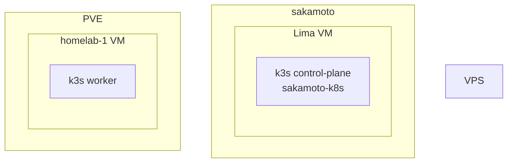
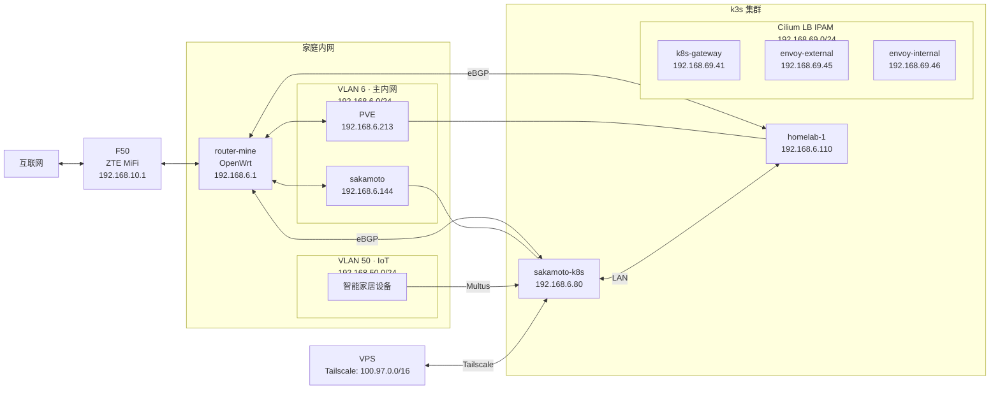
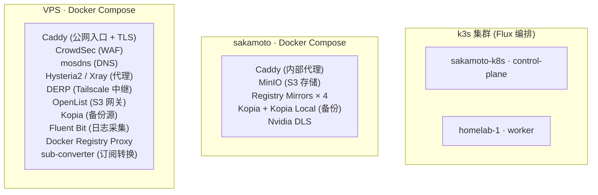
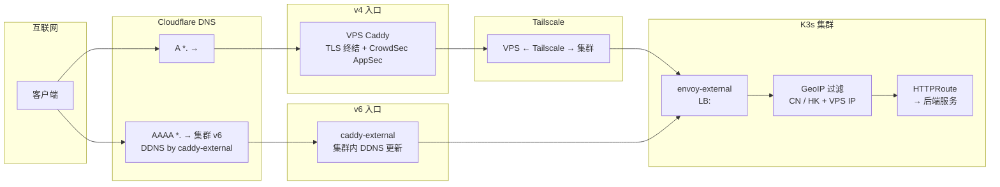
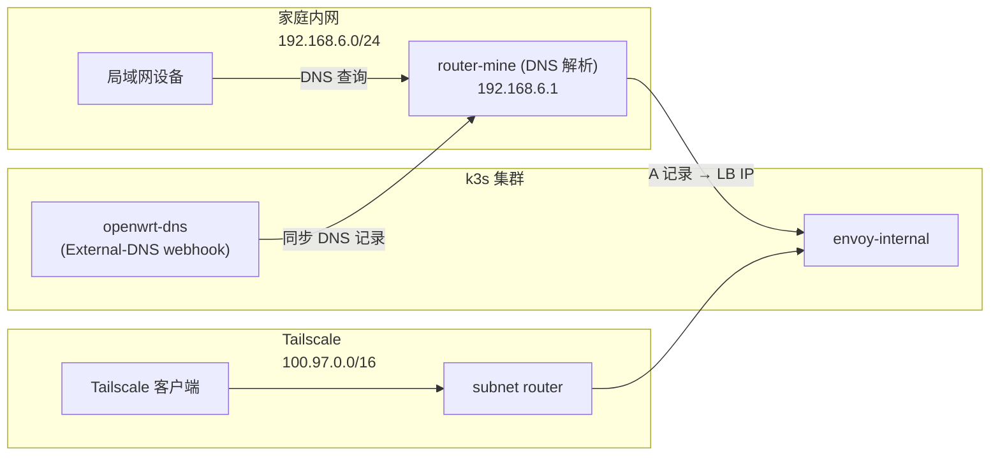
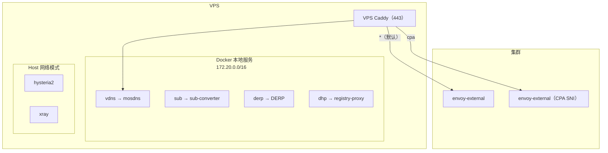
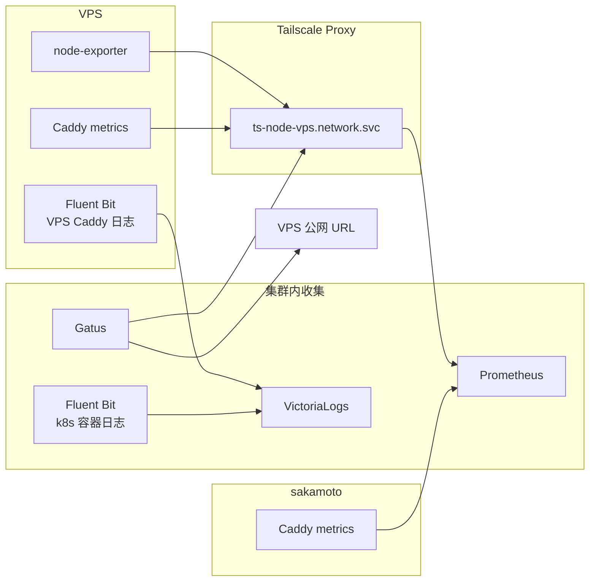
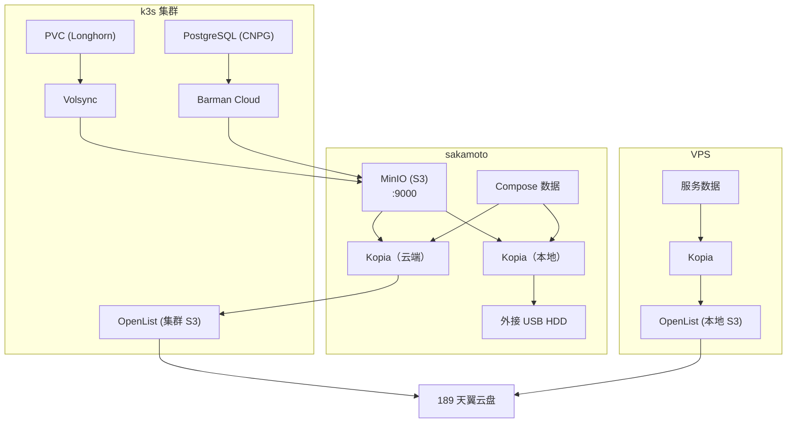

# 架构总览

> 本文件描述整个 homelab 的物理部署、服务分布、网络入口、
> 监控采集和备份链路。所有敏感信息已替换为占位符。

---

## 1. 物理部署



## 2. 网络拓扑



### 连接方式

| 链路 | 方式 | 说明 |
|------|------|------|
| F50 ↔ 互联网 | WAN (移动数据) | F50 是 router-mine 的互联网出口 |
| router-mine ↔ F50 | LAN | router-mine 通过 F50 出网；F50 断线时 zte-mifi-healer 自动重连 |
| sakamoto ↔ router-mine | LAN (VLAN 6) | 192.168.6.0/24 |
| PVE ↔ router-mine | LAN (VLAN 6) | 192.168.6.0/24 |
| IoT 设备 ↔ router-mine | LAN (VLAN 50) | 192.168.50.0/24 |
| IoT 设备 → k3s pods | Multus CNI | VLAN 50 接入集群 |
| sakamoto-k8s ↔ homelab-1 | LAN (VLAN 6) | k3s 节点间通信 |
| router-mine ↔ k3s 节点 | eBGP | Cilium 向 router-mine 通告 PodCIDR 和 LoadBalancerIP |
| Cilium LB IPAM | 192.168.69.0/24 | k8s-gateway: 192.168.69.41；envoy-external: 192.168.69.45；envoy-internal: 192.168.69.46 |
| VPS ↔ sakamoto-k8s | Tailscale | 100.97.0.0/16，VPS 通过 Tailscale 直连集群 subnet router |

---

## 3. 服务分布

> 本节只列主要 Compose 服务，不是完整容器清单；辅助容器以实际 `docker-compose.yml` 为准。



---

## 4. 入口流量全景

### DNS 解析链

```
用户服务:  A *. → <VPS_IP>

内部 DNS:  CNAME homelab-external → homelab-dynamic
              ├── A: VPS IP（手动）
              └── AAAA: 集群 v6（DDNS，由集群内 caddy-external 更新）

ExternalDNS 自动管理各服务子域名的记录
```

### 流量路径



### 内网入口



### 入口一览

| # | 入口 | 协议 | DNS 链 | 终点 | 状态 |
|---|------|------|--------|------|------|
| 1 | VPS Caddy (v4) | 公网 | A `*` → VPS → Tailscale | envoy-external | ✅ 活跃 |
| 2 | caddy-external (v6) | 公网 | AAAA `*` → 集群 v6 | envoy-external | ✅ 活跃 |
| 3 | envoy-internal | 内网 | OpenWrt DNS (openwrt-dns 同步) → LB | envoy-internal | ✅ 活跃 |
| 4 | Tailscale | 内网 | 直连 → subnet router | 集群服务 | ✅ 活跃 |
| ~5~ | Cloudflare Tunnel | — | — | — | ❌ 已停用 |
| ~6~ | NetBird | — | — | — | ❌ 已停用 |

---

## 5. VPS Caddy 路由



| 域名 | 路由目标 | 说明 |
|------|---------|------|
| `*`（默认） | → Tailscale → envoy-external | 大部分服务 |
| `cpa` | → Tailscale → envoy-external（CPA SNI） | CPA 协议专用 |
| `sub` | → 本地 sub-converter | 订阅转换 |
| `derp` | → 本地 DERP | Tailscale 中继 |
| `dhp` | → 本地 registry-proxy | Docker 镜像代理 |
| `vdns` | → 本地 mosdns | DNS 服务 |

> hysteria2、xray 使用 `network_mode: host`，不经过 Caddy，
> 直接暴露在宿主机端口。

---

## 6. 监控与日志采集



### 采集目标

| 数据源 | 代理方式 | 采集方式 |
|--------|---------|---------|
| VPS node-exporter | ts-node-vps:9100 | Prometheus |
| VPS Caddy metrics | ts-node-vps:2019 | Prometheus |
| VPS Docker 状态 | ts-node-vps:2575 | Gatus / Homepage |
| sakamoto Caddy | sakamoto.lan:2019 | Prometheus |
| VPS Caddy 访问日志 | VPS Fluent Bit | VictoriaLogs |
| k8s 容器日志 | 集群 Fluent Bit | VictoriaLogs |

---

## 7. 备份链路



### 备份配置

| 链路 | 备份源 | 存储后端 | 目标 | 调度 |
|------|--------|---------|------|------|
| k8s PVC | Longhorn 快照 | Volsync → MinIO (sakamoto S3) | 189 云盘 | 每小时 |
| PostgreSQL | CNPG 集群 | Barman → MinIO (sakamoto S3) | 189 云盘 | 按 WAL 归档 |
| sakamoto MinIO | MinIO 数据 | Kopia → OpenList (集群 S3) | 189 云盘 | 6 小时 |
| sakamoto Compose | Compose 数据 | Kopia → OpenList (集群 S3) | 189 云盘 | 1 小时 |
| sakamoto 本地 | 用户数据 | Kopia Local → 外接 USB HDD | 本地 | 12 小时 |
| VPS 服务数据 | VPS 数据 | Kopia → OpenList (VPS 本地 S3) | 189 云盘 | 4 小时 |

> Kopia 仓库配置通过 `.env.tpl` 从外部密钥管理注入，不提交到 Git。
