# 架构总览

> 本文件描述整个 homelab 的物理部署、服务分布、网络入口、
> 监控采集和备份链路。所有敏感信息已替换为占位符。

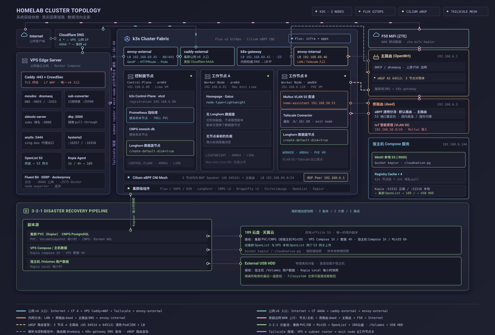

> 图中一条连线只表达一个关系，两端吸附到具体卡片；实线为数据流（配色见底部图例），虚线为控制面信令（eBGP 路由宣告、内网 DNS 同步）。
> 自上而下的层级即为真实依赖顺序：公网与解析 → VPS 边缘 / 家庭网络 → 覆盖隧道 → k3s 集群 → 3-2-1 容灾。

---

## 1. 物理部署

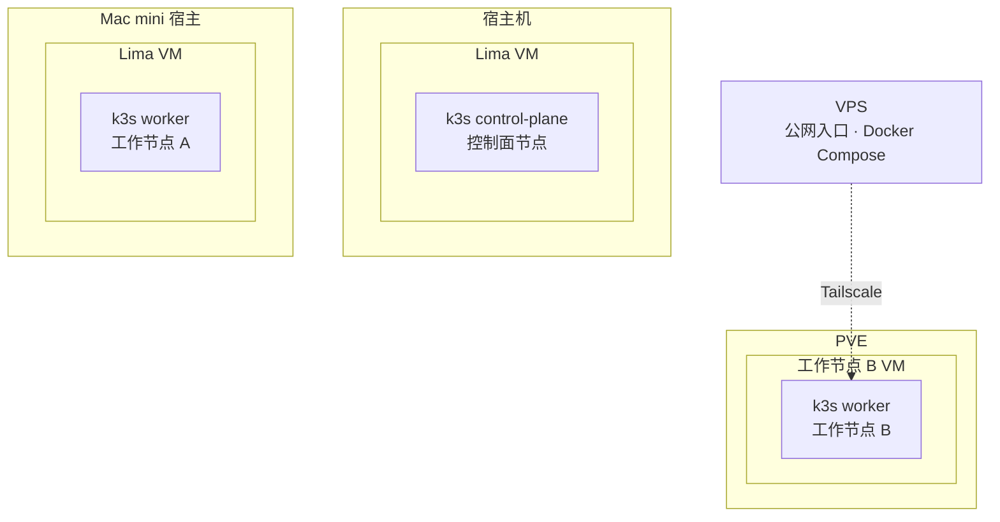
```mermaid
graph TB
    subgraph SAKAMOTO["宿主机"]
        subgraph LIMA["Lima VM"]
            CP["k3s control-plane<br/>控制面节点"]
        end
    end

    subgraph PVE["PVE"]
        subgraph PVE_VM["工作节点 B VM"]
            WORKER["k3s worker<br/>工作节点 B"]
        end
    end

    subgraph YUUKO["Mac mini 宿主"]
        subgraph LIMA2["Lima VM"]
            WORKER2["k3s worker<br/>工作节点 A"]
        end
    end

    VPS["VPS<br/>公网入口 · Docker Compose"]
    VPS -.->|"Tailscale"| WORKER
```

## 2. 网络拓扑

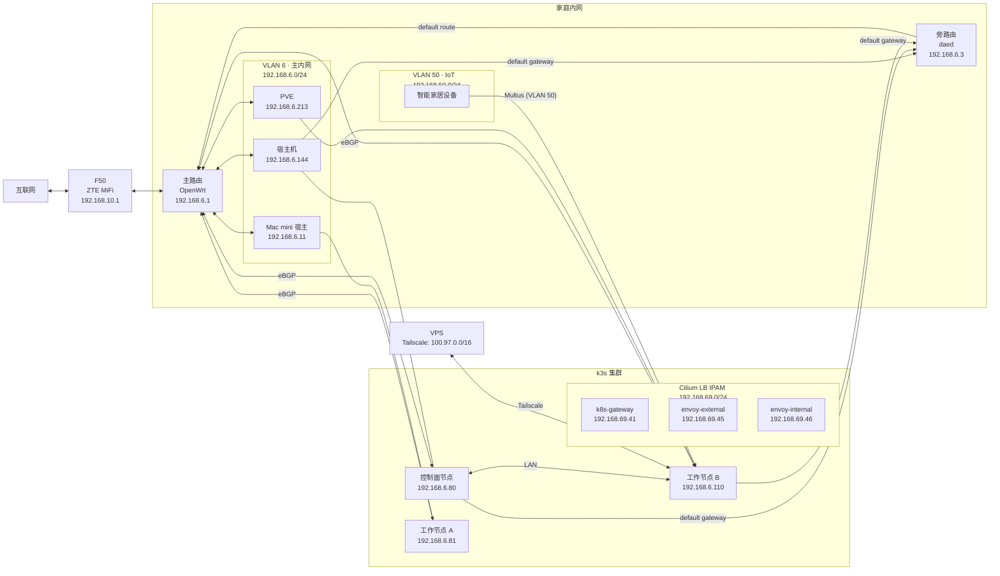
```mermaid
graph LR
    Internet["互联网"]
    F50["F50<br/>ZTE MiFi<br/>192.168.10.1"]

    subgraph HOME["家庭内网"]
        Router["主路由<br/>OpenWrt<br/>192.168.6.1"]
        BYPASS["旁路由<br/>daed<br/>192.168.6.3"]

        subgraph VLAN6["VLAN 6 · 主内网<br/>192.168.6.0/24"]
            SAKAMOTO["宿主机<br/>192.168.6.144"]
            YUUKO_HOST["Mac mini 宿主<br/>192.168.6.11"]
            PVE_NODE["PVE<br/>192.168.6.213"]
        end

        subgraph VLAN50["VLAN 50 · IoT<br/>192.168.50.0/24"]
            IOT["智能家居设备"]
        end
    end

    subgraph K8S["k3s 集群"]
        CP["控制面节点<br/>192.168.6.80"]
        WORKER["工作节点 B<br/>192.168.6.110"]
        WORKER2["工作节点 A<br/>192.168.6.81"]

        subgraph LBIPAM["Cilium LB IPAM<br/>192.168.69.0/24"]
            K8SGW["k8s-gateway<br/>192.168.69.41"]
            ENV_EXT["envoy-external<br/>192.168.69.45"]
            ENV_INT["envoy-internal<br/>192.168.69.46"]
        end
    end

    VPS["VPS<br/>Tailscale: 100.97.0.0/16"]

    Internet <--> F50
    F50 <--> Router
    BYPASS -->|"default route"| Router
    SAKAMOTO -->|"default gateway"| BYPASS
    CP -->|"default gateway"| BYPASS
    WORKER -->|"default gateway"| BYPASS
    Router <--> SAKAMOTO
    Router <--> YUUKO_HOST
    Router <--> PVE_NODE
    Router <-->|"eBGP"| CP
    Router <-->|"eBGP"| WORKER
    Router <-->|"eBGP"| WORKER2
    SAKAMOTO --- CP
    YUUKO_HOST --- WORKER2
    PVE_NODE --- WORKER
    CP <-->|"LAN"| WORKER
    IOT -->|"Multus (VLAN 50)"| WORKER
    VPS <-->|"Tailscale"| WORKER
```

### 连接方式

| 链路 | 方式 | 说明 |
|------|------|------|
| F50 ↔ 互联网 | WAN (移动数据) | F50 是主路由的互联网出口 |
| 主路由 ↔ F50 | LAN | 主路由通过 F50 出网；F50 断线时 zte-mifi-healer 自动重连 |
| 旁路由 ↔ 主路由 | LAN (VLAN 6) | 旁路由 (daed)；自身默认路由仍指向主路由 |
| 宿主机 ↔ 主路由 | LAN (VLAN 6) | 192.168.6.0/24 |
| PVE ↔ 主路由 | LAN (VLAN 6) | 192.168.6.0/24 |
| Mac mini 宿主 ↔ 主路由 | LAN (VLAN 6) | 192.168.6.0/24，宿主有线桥接 |
| IoT 设备 ↔ 主路由 | LAN (VLAN 50) | 192.168.50.0/24 |
| IoT 设备 → k3s pods | Multus CNI | VLAN 50 由 multus-iot 直通 Pod（home-assistant 192.168.50.51），调度偏好工作节点 B |
| 控制面节点 ↔ 工作节点 B / 工作节点 A | LAN (VLAN 6) | k3s 节点间通信 |
| 主路由 ↔ k3s 节点 | eBGP | Cilium 向主路由通告 PodCIDR 和 LoadBalancerIP |
| Cilium LB IPAM | 192.168.69.0/24 | k8s-gateway: 192.168.69.41；envoy-external: 192.168.69.45；envoy-internal: 192.168.69.46 |
| VPS ↔ 工作节点 B | Tailscale | 100.97.0.0/16，subnet router + exit node 由 operator Connector `ts-router` 承载（调度偏好工作节点 B），通告 192.168.6.0/24、192.168.10.0/24、192.168.69.0/24 |

---

## 3. 服务分布

> 本节只列主要 Compose 服务，不是完整容器清单；辅助容器以实际 `docker-compose.yml` 为准。

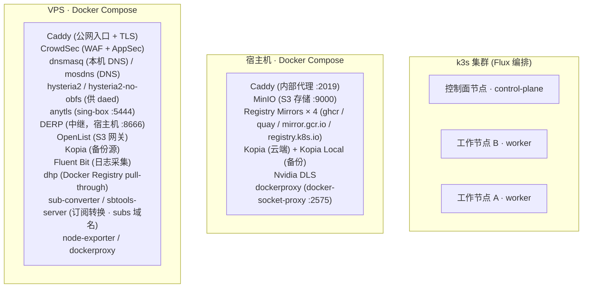
```mermaid
graph TB
    subgraph K3S["k3s 集群 (Flux 编排)"]
        NODE_SAKA["控制面节点 · control-plane"]
        NODE_H1["工作节点 B · worker"]
        NODE_YUUKO["工作节点 A · worker"]
    end

    subgraph COMPOSE_SAKA["宿主机 · Docker Compose"]
        CD_SAKA["Caddy (内部代理 :2019)
MinIO (S3 存储 :9000)
Registry Mirrors × 4 (ghcr / quay / mirror.gcr.io / registry.k8s.io)
Kopia (云端) + Kopia Local (备份)
Nvidia DLS
dockerproxy (docker-socket-proxy :2575)"]
    end

    subgraph COMPOSE_VPS["VPS · Docker Compose"]
        CD_VPS["Caddy (公网入口 + TLS)
CrowdSec (WAF + AppSec)
dnsmasq (本机 DNS) / mosdns (DNS)
hysteria2 / hysteria2-no-obfs (供 daed)
anytls (sing-box :5444)
DERP (中继，宿主机 :8666)
OpenList (S3 网关)
Kopia (备份源)
Fluent Bit (日志采集)
dhp (Docker Registry pull-through)
sub-converter / sbtools-server (订阅转换 · subs 域名)
node-exporter / dockerproxy"]
    end
```

---

## 4. 入口流量全景

### DNS 解析链

```
用户服务:  A *. → <VPS_IP>

内部 DNS:  CNAME homelab-external → homelab-dynamic
              ├── A: VPS IP（手动）
              └── AAAA: 集群 v6（DDNS，由集群内 caddy-external 更新）

ExternalDNS 自动管理各服务子域名的记录

VPS 本机 DNS:
  127.0.0.1 -> dnsmasq
               MAIN_DOMAIN -> k8s-gateway 192.168.69.41
               其他域名 -> 公网 DNS
```

### 流量路径

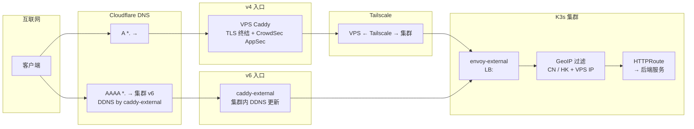
```mermaid
graph LR
    subgraph INTERNET["互联网"]
        Client["客户端"]
    end

    subgraph DNS["Cloudflare DNS"]
        DNS_A["A *. → <VPS_IP>"]
        DNS_AAAA["AAAA *. → 集群 v6
DDNS by caddy-external"]
    end

    subgraph ENTRY_VPS["v4 入口"]
        VPS_Caddy["VPS Caddy
TLS 终结 + CrowdSec AppSec"]
    end

    subgraph ENTRY_V6["v6 入口"]
        Caddy_External["caddy-external
集群内 DDNS 更新"]
    end

    subgraph TAILSCALE["Tailscale"]
        TS_Link["VPS ← Tailscale → 集群"]
    end

    subgraph CLUSTER["K3s 集群"]
        Envoy_External["envoy-external
LB: <ENVOY_EXT_IP>"]
        GeoIP["GeoIP 过滤
CN / HK + VPS IP"]
        HTTPRoute["HTTPRoute
→ 后端服务"]
    end

    Client --> DNS_A
    DNS_A --> VPS_Caddy
    VPS_Caddy --> TS_Link
    TS_Link --> Envoy_External

    Client --> DNS_AAAA
    DNS_AAAA --> Caddy_External
    Caddy_External --> Envoy_External

    Envoy_External --> GeoIP
    GeoIP --> HTTPRoute
```

### 内网入口与旁路由 DNS

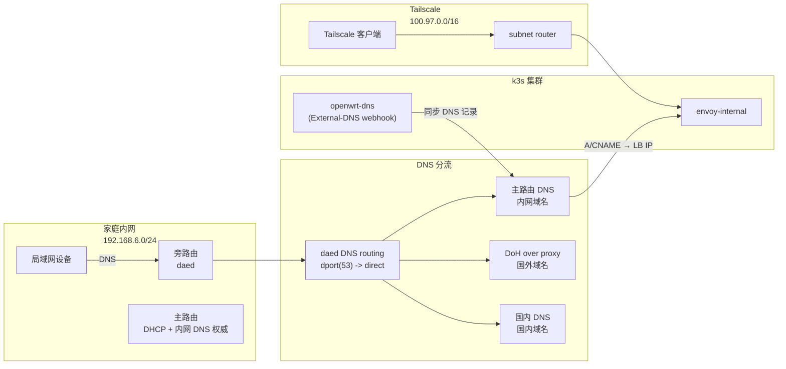
```mermaid
graph LR
    subgraph LAN["家庭内网<br/>192.168.6.0/24"]
        Client["局域网设备"]
        BYPASS["旁路由<br/>daed"]
        Router["主路由<br/>DHCP + 内网 DNS 权威"]
    end

    subgraph DNSPATH["DNS 分流"]
        DaeDNS["daed DNS routing<br/>dport(53) -> direct"]
        RouterDNS["主路由 DNS<br/>内网域名"]
        ForeignDNS["DoH over proxy<br/>国外域名"]
        CNDNS["国内 DNS<br/>国内域名"]
    end

    subgraph TS["Tailscale<br/>100.97.0.0/16"]
        TS_Client["Tailscale 客户端"]
        TS_Subnet["subnet router"]
    end

    subgraph K8S["k3s 集群"]
        OpenwrtDNS["openwrt-dns<br/>(External-DNS webhook)"]
        Envoy_Internal["envoy-internal"]
    end

    Client -->|"DNS"| BYPASS
    BYPASS --> DaeDNS
    DaeDNS --> RouterDNS
    DaeDNS --> ForeignDNS
    DaeDNS --> CNDNS
    OpenwrtDNS -->|"同步 DNS 记录"| RouterDNS
    RouterDNS -->|"A/CNAME → LB IP"| Envoy_Internal
    TS_Client --> TS_Subnet
    TS_Subnet --> Envoy_Internal
```

### 内网记录归属

内网 DNS 记录有两个来源，都落进路由器 dnsmasq 的同一张 hosts 表

- 集群内服务：HTTPRoute hostname 由集群里的 openwrt-dns（external-dns webhook）经 LuCI RPC 写成路由器 `/etc/config/dhcp` 的 `config cname`，dnsmasq 启动时展开到 `/tmp/hosts/dhcp.<cfg>`，再以 `--addn-hosts` 读入
- 集群外服务（宿主机上的 minio、镜像代理等）：仓库 `router/dnsmasq-int.hosts` 声明，`task router:dns:diff` 比对、`task router:dns:sync` 下发到路由器 `/etc/dnsmasq.d/int.hosts`，通过 UCI `addnhosts` 注册。两个坑：`addnhosts` 是 list 语义，必须 `add_list`；被指向的路径要先存在，否则 `uci commit` 触发的 ucitrack 重载会让 dnsmasq 启动失败、整网解析中断
- 同名不能同时出现在两处：dnsmasq 对重复名字会返回多个地址并按查询轮换，不报错也不提示

查现网实际生效的记录

```bash
ssh <ROUTER> "uci show dhcp | grep -E '=domain|=cname'"
ssh <ROUTER> "cat /tmp/hosts/dhcp.*"
ssh <ROUTER> "cat /etc/dnsmasq.d/int.hosts"
```

内网入口迁入独立子域的分层决策见 [内网域决策](./adr/0002-internal-domain-static-client-dns.md)

### 入口一览

| # | 入口 | 协议 | DNS 链 | 终点 | 状态 |
|---|------|------|--------|------|------|
| 1 | VPS Caddy (v4) | 公网 | A `*` → VPS → Tailscale | envoy-external | ✅ 活跃 |
| 2 | caddy-external (v6) | 公网 | AAAA `*` → 集群 v6 | envoy-external | ✅ 活跃 |
| 3 | envoy-internal | 内网 | 客户端 DNS → 旁路由 daed → 主路由 DNS (openwrt-dns 同步) → LB | envoy-internal | ✅ 活跃 |
| 4 | Tailscale | 内网 | 直连 → subnet router | 集群服务 | ✅ 活跃 |
| ~5~ | Cloudflare Tunnel | 无 | 无 | 无 | ❌ 已停用 |
| ~6~ | NetBird | 无 | 无 | 无 | ❌ 已停用 |

> 内网 DNS 里除集群服务外还有集群外内部服务（宿主机上的 minio、镜像代理、PVE 面板等），它们解析到 192.168.6.144，不经 envoy

---

## 5. VPS Caddy 路由

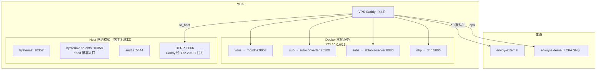
```mermaid
graph TB
    subgraph VPS["VPS"]
        Caddy["VPS Caddy（443）"]

        subgraph LOCAL["Docker 本地服务<br/>172.20.0.0/16"]
            mosdns["vdns → mosdns:9053"]
            subconv["sub → sub-converter:25500"]
            sbtools["subs → sbtools-server:8080"]
            dhp["dhp → dhp:5000"]
        end

        subgraph HOST["Host 网络模式（宿主机端口）"]
            hysteria2["hysteria2 :10357"]
            hysteria2_no_obfs["hysteria2-no-obfs :10358<br/>daed 兼容入口"]
            anytls["anytls :5444"]
            derp["DERP :8666<br/>Caddy 经 172.20.0.1 回打"]
        end
    end

    subgraph CLUSTER["集群"]
        Envoy["envoy-external"]
        Envoy_CPA["envoy-external（CPA SNI）"]
    end

    Caddy -->|"cpa"| Envoy_CPA
    Caddy -->|"*（默认）"| Envoy
    Caddy --> mosdns
    Caddy --> subconv
    Caddy --> sbtools
    Caddy --> dhp
    Caddy -->|"to_host"| derp
```

| 域名 | 路由目标 | 说明 |
|------|---------|------|
| `*`（默认） | → Tailscale → envoy-external | 大部分服务 |
| `cpa` | → Tailscale → envoy-external（CPA SNI） | CPA 协议专用 |
| `sub` | → 本地 sub-converter:25500 | 订阅转换 |
| `subs` | → 本地 sbtools-server:8080 | 配置交付服务 |
| `derp` | → 宿主机 :8666（Caddy 经 172.20.0.1 回打） | Tailscale 中继 |
| `dhp` | → 本地 dhp:5000 | Docker 镜像 pull-through 代理 |
| `vdns` | → 本地 mosdns:9053 | DNS 服务 |

> hysteria2、hysteria2-no-obfs、anytls、dnsmasq 不经过 Caddy，
> 直接使用宿主机端口；no-obfs Hysteria2 供 daed 客户端使用。

---

## 6. 监控与日志采集

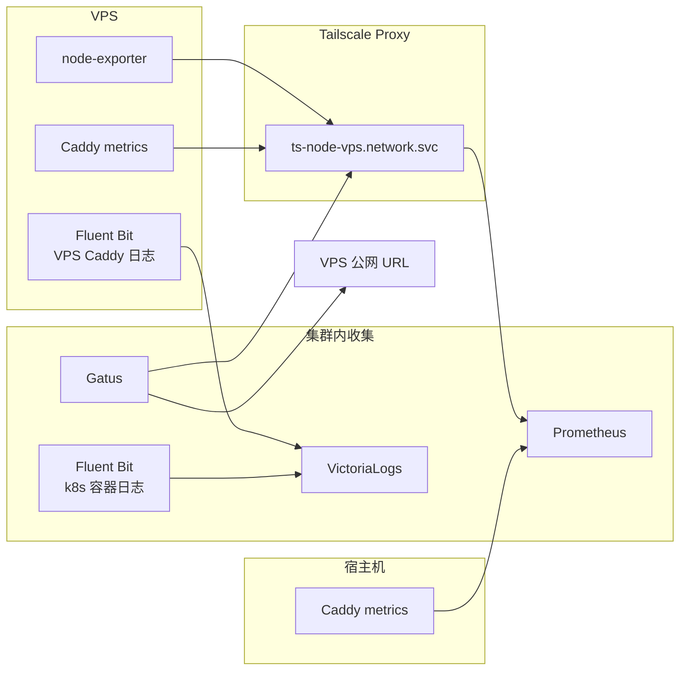
```mermaid
graph LR
    subgraph VPS["VPS"]
        NE_VPS["node-exporter"]
        CADDY_VPS["Caddy metrics"]
        FB_VPS["Fluent Bit<br/>VPS Caddy 日志"]
    end

    subgraph SAKAMOTO["宿主机"]
        CADDY_SAKA["Caddy metrics"]
    end

    subgraph TS_PROXY["Tailscale Proxy"]
        TS_SVC["ts-node-vps.network.svc"]
    end

    subgraph COLLECT["集群内收集"]
        Prometheus["Prometheus"]
        VL["VictoriaLogs"]
        Gatus["Gatus"]
        FB_K8S["Fluent Bit<br/>k8s 容器日志"]
    end

    NE_VPS --> TS_SVC
    CADDY_VPS --> TS_SVC
    TS_SVC --> Prometheus
    CADDY_SAKA --> Prometheus

    FB_VPS --> VL
    FB_K8S --> VL

    Gatus --> TS_SVC
    Gatus --> VPS_Public["VPS 公网 URL"]
```

### 采集目标

| 数据源 | 代理方式 | 采集方式 |
|--------|---------|---------|
| VPS node-exporter | ts-node-vps:9100 | Prometheus |
| VPS Caddy metrics | ts-node-vps:2019 | Prometheus |
| VPS Docker 状态 | ts-node-vps:2575 | Gatus / Homepage |
| 宿主机 Caddy | 192.168.6.144:2019 | Prometheus |
| VPS Caddy 访问日志 | VPS Fluent Bit | VictoriaLogs |
| k8s 容器日志 | 集群 Fluent Bit | VictoriaLogs |

---

## 7. 备份链路

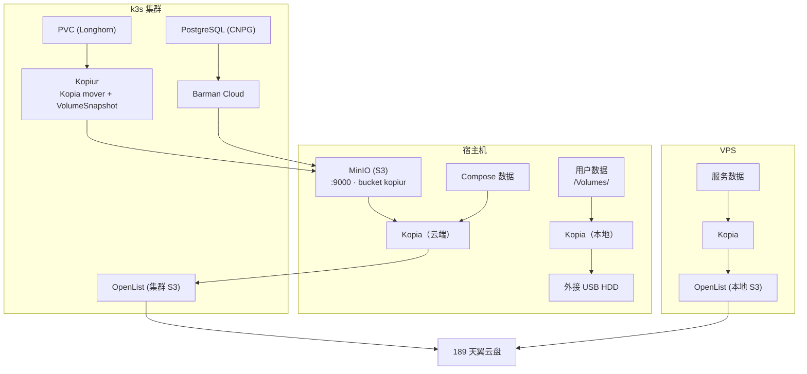
```mermaid
graph TB
    subgraph K8S["k3s 集群"]
        PVC["PVC (Longhorn)"]
        PG["PostgreSQL (CNPG)"]
        Kopiur["Kopiur<br/>Kopia mover + VolumeSnapshot"]
        Barman["Barman Cloud"]
        Cluster_OpenList["OpenList (集群 S3)"]
    end

    subgraph SAKA_BACKUP["宿主机"]
        MinIO["MinIO (S3)<br/>:9000 · bucket kopiur"]
        COMPOSE_Data["Compose 数据"]
        USER_Data["用户数据<br/>/Volumes/<USER_DATA>"]
        SAKA_Kopia["Kopia（云端）"]
        SAKA_Kopia_Local["Kopia（本地）"]
        USB_HDD["外接 USB HDD"]
    end

    subgraph VPS_BACKUP["VPS"]
        VPS_Data["服务数据"]
        VPS_Kopia["Kopia"]
        VPS_OpenList["OpenList (本地 S3)"]
    end

    Cloud["189 天翼云盘"]

    PVC --> Kopiur
    PG --> Barman
    Kopiur --> MinIO
    Barman --> MinIO

    MinIO --> SAKA_Kopia
    COMPOSE_Data --> SAKA_Kopia
    SAKA_Kopia --> Cluster_OpenList
    Cluster_OpenList --> Cloud

    USER_Data --> SAKA_Kopia_Local
    SAKA_Kopia_Local --> USB_HDD

    VPS_Data --> VPS_Kopia
    VPS_Kopia --> VPS_OpenList
    VPS_OpenList --> Cloud
```

### 备份配置

| 链路 | 备份源 | 存储后端 | 目标 | 调度 |
|------|--------|---------|------|------|
| k8s PVC | Longhorn VolumeSnapshot | Kopiur（Kopia mover）→ MinIO (宿主机 S3, bucket kopiur) | 189 云盘 | 每小时 |
| PostgreSQL | CNPG 集群 | Barman → MinIO (宿主机 S3) | 189 云盘 | 按 WAL 归档 |
| 宿主机 MinIO | MinIO 数据 | Kopia → OpenList (集群 S3) | 189 云盘 | 6 小时 |
| 宿主机 Compose | Compose 数据 | Kopia → OpenList (集群 S3) | 189 云盘 | 1 小时 |
| 宿主机本地 | 用户数据 (`/Volumes/<USER_DATA>`) | Kopia Local → 外接 USB HDD | 本地 | 每小时 |
| VPS 服务数据 | VPS 数据 | Kopia → OpenList (VPS 本地 S3) | 189 云盘 | 4 小时 |

> Kopia 仓库配置通过 `.env.tpl` 从外部密钥管理注入，不提交到 Git。
> 189 云盘是 OpenList 的运行时存储配置，不在 Git 内声明。

---

## 8. Flux 部署链路

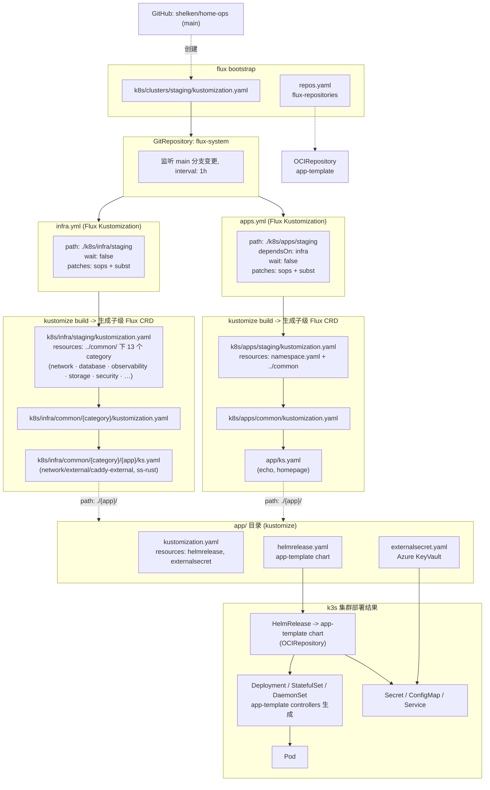
```mermaid
graph TB
    GIT["GitHub: shelken/home-ops (main)"]

    subgraph BOOT["flux bootstrap"]
        STAGING["k8s/clusters/staging/kustomization.yaml"]
        REPOS["repos.yaml<br/>flux-repositories"]
    end

    subgraph SOURCE["GitRepository: flux-system"]
        SRC_MONITOR["监听 main 分支变更, interval: 1h"]
    end

    subgraph INFRA_LAYER["infra.yml (Flux Kustomization)"]
        INFRA_CFG["path: ./k8s/infra/staging<br/>wait: false<br/>patches: sops + subst"]
    end

    subgraph APPS_LAYER["apps.yml (Flux Kustomization)"]
        APPS_CFG["path: ./k8s/apps/staging<br/>dependsOn: infra<br/>wait: false<br/>patches: sops + subst"]
    end

    subgraph KUSTOMIZE_INFRA["kustomize build -> 生成子级 Flux CRD"]
        IN_CAT["k8s/infra/staging/kustomization.yaml<br/>resources: ../common/ 下 13 个 category<br/>(network · database · observability · storage · security · …)"]
        IN_CATEGORY["k8s/infra/common/{category}/kustomization.yaml"]
        IN_CHILD["k8s/infra/common/{category}/{app}/ks.yaml<br/>(network/external/caddy-external, ss-rust)"]
        IN_CAT --> IN_CATEGORY --> IN_CHILD
    end

    subgraph KUSTOMIZE_APPS["kustomize build -> 生成子级 Flux CRD"]
        AP_CAT["k8s/apps/staging/kustomization.yaml<br/>resources: namespace.yaml + ../common"]
        AP_LAYER["k8s/apps/common/kustomization.yaml"]
        AP_CHILD["app/ks.yaml<br/>(echo, homepage)"]
        AP_CAT --> AP_LAYER --> AP_CHILD
    end

    subgraph APP_DIR["app/ 目录 (kustomize)"]
        DIR_KS["kustomization.yaml<br/>resources: helmrelease, externalsecret"]
        DIR_HR["helmrelease.yaml<br/>app-template chart"]
        DIR_ES["externalsecret.yaml<br/>Azure KeyVault"]
    end

    subgraph CLUSTER["k3s 集群部署结果"]
        HELM["HelmRelease -> app-template chart<br/>(OCIRepository)"]
        WORKLOAD["Deployment / StatefulSet / DaemonSet<br/>app-template controllers 生成"]
        OBJ["Secret / ConfigMap / Service"]
        POD["Pod"]
    end

    GIT -.->|创建| STAGING
    STAGING --> SOURCE
    OCI["OCIRepository<br/>app-template"]
    REPOS -.-> OCI

    SOURCE --> INFRA_LAYER
    SOURCE --> APPS_LAYER

    INFRA_LAYER --> IN_CAT
    APPS_LAYER --> AP_CAT

    IN_CHILD -.->|path: ./#123;app#125;/| APP_DIR
    AP_CHILD -.->|path: ./#123;app#125;/| APP_DIR

    DIR_HR --> HELM
    DIR_ES --> OBJ
    HELM --> WORKLOAD
    WORKLOAD --> POD
    HELM --> OBJ
```

### 部署顺序

| 层 | Kustomization | 入口 | 等待上游 | 说明 |
|---|-------------|------|---------|------|
| 0 | `flux-system` GitRepository | 由 bootstrap 创建 | 无 | 监听代码仓库，触发所有同步 |
| 1 | `flux-repositories` | `repos.yaml` → `k8s/clusters/common/repos/` | 无 | 预注册 Helm chart 源（app-template 等） |
| 2 | `infra` | `infra.yml` → `k8s/infra/staging/` | 无 | 基础设施先部署，`wait: false` |
| 3 | 各 infra 子 Kustomization | `k8s/infra/common/{category}/<app>/ks.yaml` | infra 层父级 | 网络、存储、数据库、监控等 |
| 4 | `apps` | `apps.yml` → `k8s/apps/staging/` | infra 完成 | 应用层后部署，`wait: false` |
| 5 | 各 apps 子 Kustomization | `k8s/apps/common/<app>/ks.yaml` | apps 层父级 | 普通业务应用 |

### 关键机制

- **变量注入**：所有子 Kustomization 自动获得 `cluster-secrets`（Secret）和 `cluster-settings`（ConfigMap）中的 postBuild 变量。可通过标签 `substitution.flux/disabled: "true"` 跳过。
- **SOPS 解密**：所有子 Kustomization 自动获得 SOPS age 解密能力。
- **等待策略**：两层均 `wait: false`，顺序由 `apps.dependsOn: infra` 保证（成因见 [024](../postmortems/024-flux-wait-recursion-retry-gap-freezes-apps.md)）
- **失败重试**：子级须声明 `retryInterval`，巡检 `scripts/verify-ks-retry-interval.sh`
- **HelmRelease**：最终通过 `app-template` chart（OCIRepository）或直接 Helm chart 部署 Pod。
- **外部服务注册**：运行在集群外的服务经 selector-less Service + EndpointSlice 注册为普通集群 Service（后端 IP 走 cluster-settings 注入，机制取舍见 [ADR-0002](../docs/adr/0002-external-service-endpointslice.md)），按需挂 envoy-internal HTTPRoute 与 gatus 探活

## 9. 集群外服务接入

首个实例:yuuko 上的 oMLX(Qwen3-ASR)注册为 `stt-voice`(default ns,端口 8900);宿主侧安装与配置由 nix-config 管理(`shelken.homelab.omlx`),home-ops 仅注册端点,`task omlx:*` 仅启停与观察

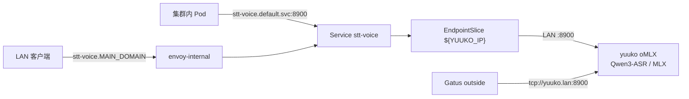
```mermaid
graph LR
    POD["集群内 Pod"] -->|"stt-voice.default.svc:8900"| SVC["Service stt-voice"]
    LAN["LAN 客户端"] -->|"stt-voice.MAIN_DOMAIN"| GW["envoy-internal"]
    GW --> SVC
    SVC --> ES["EndpointSlice ${YUUKO_IP}"]
    ES -->|"LAN :8900"| OMLX["yuuko oMLX<br/>Qwen3-ASR / MLX"]
    GATUS["Gatus outside"] -->|"tcp://yuuko.lan:8900"| OMLX
```

规格、文件树、task 行为与宿主侧事实见 [omlx/README.md](../omlx/README.md)
