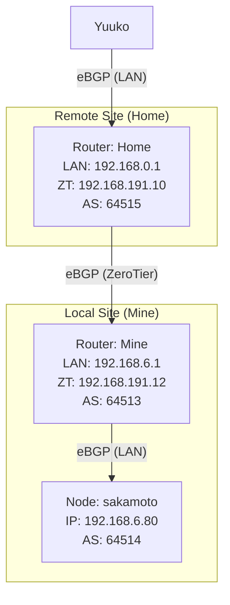

## BGP Configuration



### router-mine (192.168.6.1)

[/etc/bird.conf](../../../../../docs/router/resource/mine.conf)

### router-home (192.168.191.10)

[/etc/bird.conf](../../../../../docs/router/resource/home.conf)

### Firewall Configuration

`/etc/config/firewall` (On Router-Mine)

`NOTRACK` 告诉 netfilter 不要跟踪这些包的状态，不要在 conntrack 表里创建条目，直接放行。这样它就不会因为“没看到回程包”而丢弃后续的 ACK/TLS 数据了

```conf
config rule
	option name 'Allow-K8s-LB-Asymmetric'
	option src 'lan'
	option dest 'lan'
	list proto 'all'
	option dest_ip '192.168.69.0/24'
	option target 'NOTRACK'
```

对于本地和远程站点之间的Pod CIDR（‘ 10.42.0.0/16 ‘）流量，确保在’ lan ’和‘ zt ’区域之间启用‘转发’

```shell
# Check BIRD status
birdc configure check
birdc configure
birdc show protocols
birdc show route
```
