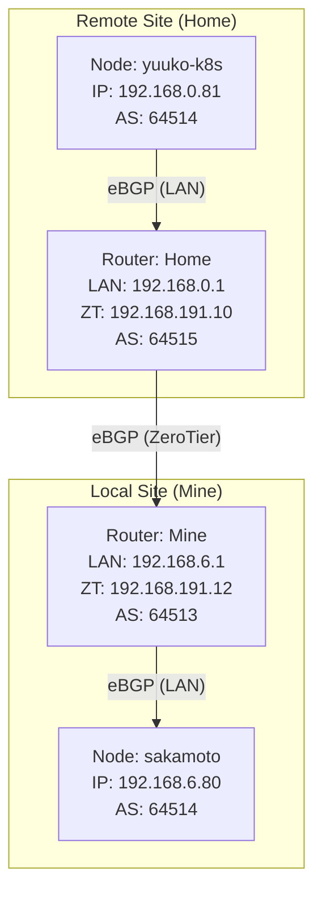

## BGP Configuration

### Network Topology

To enable Native Routing between the local cluster (Mine) and the remote node (Home), we use a BGP peering topology where routers at both sites exchange routes via ZeroTier VPN.

*   **Local Site (Mine)**: `192.168.6.0/24`, ASN `64513`
*   **Remote Site (Home)**: `192.168.0.0/24`, ASN `64515`
*   **Interconnect**: ZeroTier VPN `192.168.191.0/24`



### router-mine (192.168.6.1)

`/etc/bird.conf`

```conf
router id 192.168.6.1;

log syslog { info, warning, error };

# 定义常量
define LOCAL_ASN = 64513;
define K8S_ASN = 64514;

# 设备协议
protocol device {
    scan time 10;
}

# 直连协议
protocol direct {
    ipv4;
    # 指定您的接口，通常是 br-lan（LAN网桥）
    interface "br-lan";
}

# 内核协议
protocol kernel {
    ipv4 {
        import all;      # 从内核学习路由
        export all;      # 导出路由到内核路由表
    };
    persist;
    learn;               # 学习直接路由
}

# 过滤器
filter accept_k8s_routes {
    # 只接受 Kubernetes 的服务 IP（/32）
    if net.len = 32 then accept;
    
    # 可选：也接受 Pod CIDR（10.42.0.0/16）
    if net ~ [ 10.42.0.0/16{24,32} ] then accept;
    
    reject;
}

filter export_local_routes {
    # 导出本地网络和直连路由
    if net = 192.168.6.0/24 then accept;
    if net ~ [ 10.42.0.0/16{24,32} ] then accept;
    if net.len = 32 then accept;
    reject;
}

# BGP 模板
template bgp k8s {
    local as LOCAL_ASN;
    hold time 90;
    keepalive time 30;
    
    ipv4 {
        import filter accept_k8s_routes;
        export filter export_local_routes;
        next hop self;
    };
}

# 连接本地 K8s 节点
protocol bgp sakamoto_k8s from k8s {
    neighbor 192.168.6.80 as K8S_ASN;
}

protocol bgp homelab_1 from k8s {
    neighbor 192.168.6.110 as K8S_ASN;
}

protocol bgp tvbox from k8s {
    neighbor 192.168.6.141 as K8S_ASN;
}

# 连接远程路由器 (eBGP via ZeroTier)
protocol bgp router_home {
    local as LOCAL_ASN;
    neighbor 192.168.191.10 as 64515; # Router-Home ASN
    
    ipv4 {
        import all;
        export all;
        next hop self;
    };
}
```

### router-home (192.168.191.10)

`/etc/bird.conf`

```conf
log syslog { info, warning, error };
router id 192.168.191.10;

define LOCAL_ASN = 64515;
define K8S_ASN = 64514;

protocol device {
    scan time 10;
}

protocol direct {
    ipv4;
    interface "zt*", "br-lan";
}

protocol kernel {
    ipv4 {
        import all;
        export all;
    };
    persist;
    learn;
}

filter accept_all {
    accept;
}

# Template for eBGP (Yuuko)
template bgp k8s_peer {
    local as LOCAL_ASN;
    hold time 90;
    
    ipv4 {
        import all;
        export all;
        next hop self;
    };
}

# Template for eBGP (Router-Mine)
template bgp router_peer {
    local as LOCAL_ASN;
    hold time 90;
    
    ipv4 {
        import all;
        export all;
        next hop self;
    };
}

# 连接本地 K8s 节点 (Yuuko)
protocol bgp yuuko from k8s_peer {
    neighbor 192.168.0.81 as K8S_ASN;
}

# 连接远程路由器 (Router-Mine)
protocol bgp router_mine from router_peer {
    neighbor 192.168.191.12 as 64513; # Router-Mine ASN
}
```

### Firewall Configuration

`/etc/config/firewall` (On Router-Mine)

`NOTRACK` 告诉 netfilter 不要跟踪这些包的状态，不要在 conntrack 表里创建条目，直接放行。这样它就不会因为“没看到回程包”而丢弃后续的 ACK/TLS 数据了

```conf
config rule
	option name 'Allow-K8s-LB-Asymmetric'
	option src 'lan'
	option dest 'lan'
	list proto 'all'
	option dest_ip '192.168.69.0/24'
	option target 'NOTRACK'
```

对于本地和远程站点之间的Pod CIDR（‘ 10.42.0.0/16 ‘）流量，确保在’ lan ’和‘ zt ’区域之间启用‘转发’

```shell
# Check BIRD status
birdc configure check
birdc configure
birdc show protocols
birdc show route
```
